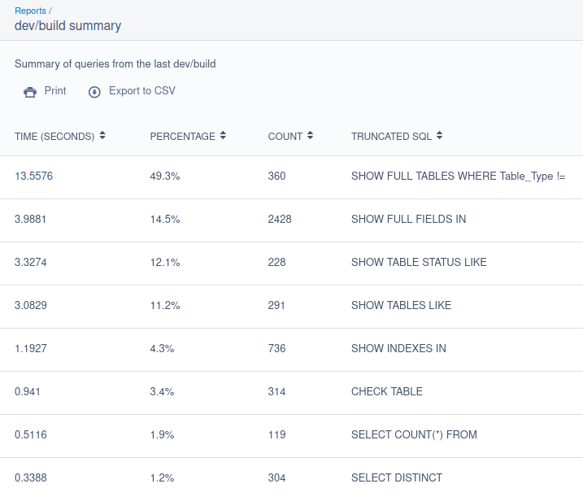

# Silverstripe dev/build benchmark

Will benchmark the time taken to run queries during the last `dev/build` on a Silverstripe application, includeing deployments. Includes admin-only reports to show results.



There are two reports available:

A) A `dev/build summary` report (`DevBuildBenchmarkSummary`) showing the total time in seconds taken for queries, which are grouped together. This is enabled by default.
B) If configured to do so, a `dev/build queries` report (`DevBuildBenchmarkQuery`) will show the time taken in seconds for each `dev/build` run. This is useful for identifying slow queries individual that may be affecting the performance of your application.

> [!WARNING]
> The `dev/build queries` report will show **ALL** database queries run during `dev/build`. It must must enabled via the `DatabaseAdminExtension.store_query_data` configuration option. This is disabled by default.
>
> It is up to the developer installing this module to be mindful any sensitive information that may be displayed in the report, for instance any queries run during `requireDefaultRecords()`.
>
> Be sure you are aware of what will be logged before deploying this module to an environment with sensitive data e.g. production.

To enable the `dev/build queries` report, add the following to your `config.yml`:

```yaml
emteknetnz\DevBuildBenchmark\DatabaseAdminExtension:
  store_query_data: true
```

You must have `ADMIN` permissions to view the reports.

## Installation

```bash
composer require emteknetnz/silverstripe-dev-build-benchmark
```

Simply install this module. The next time `dev/build` is run, the benchmark data will be recorded in the `DevBuildBenchmark` database table.

You must be using MySQL or MariaDB to use this module. The default `MySQLDatabase` class will be replaced with the `DevBuildBenchmarkMySQLDatabase` class in this module via injector. If you have already replaced the `MySQLDatabase` class with another class then this module will not work.

This module works with Silverstripe 4 and 5.
